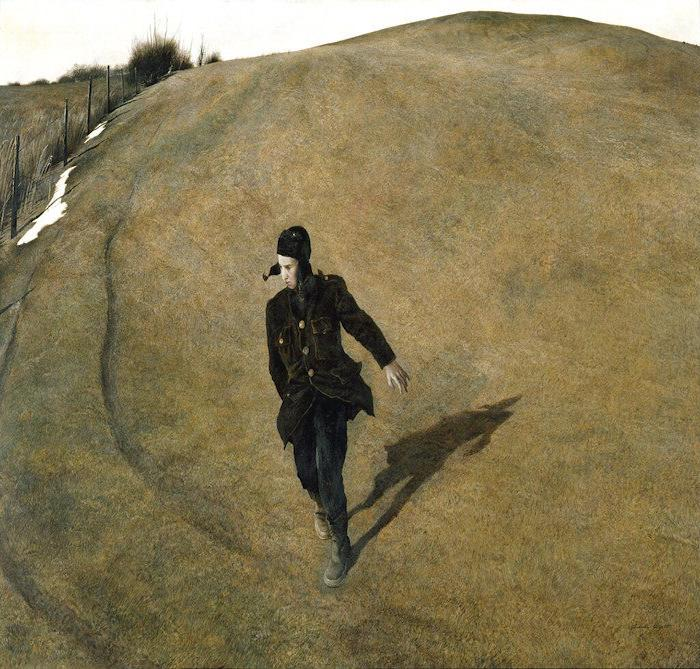

# Seam Carving


Andrew Wyeth's *Winter 1946*
<hr>

Seam carving is a means of content-aware image resizing that removes vertical seams of an image in ascending order of importance. More simply, the least important content is removed first during resizing. The method was first proposed by Avidan and Shamir (2007) in in <a href="http://citeseerx.ist.psu.edu/viewdoc/download?doi=10.1.1.570.6321&rep=rep1&type=pdf">*Seam Carving for Content-Aware Image Resizing*</a>.

Further explanations of seam carving can be found on this <a href="https://andrewdcampbell.github.io/seam-carving">blog post</a> by Andrew Campbell and this <a href="https://www.youtube.com/watch?v=rpB6zQNsbQU&ab_channel=TheJuliaProgrammingLanguage">lecture</a> by Grant Sanderson for 18.S191 at MIT.

```Seam-Carving.ipynb``` provides an implementation of photo seam carving in Python, with edges found through Sobel filters or the Laplacian operator. 

### Functionality



*Conventional resizing (left) vs. seam carving (right)*

Standard approaches to image resizing typically involve either compression, which causes distortions (above left) or cropping, which loses information. Seam carving (above right) reduces both distortion and minimizes information loss.

The algorithm works in two stages. First, it finds a map of pixelwise information importance for the target image. This frequently takes the form of an edge map, as is the case in this implementation. The edge map in this notebook can be found either with Sobel filters (a kind of convolution) or with the Laplacian operator. We can consider these methods as finding the first and second derivative of brightness in the image, respectively. Once an importance map is found, the algorithm uses dynamic programming to build a minimal importance vertical cut/seam in the image, which is then removed.

### Acknowledgements

```
Avidan, S., & Shamir, A. (2007). Seam carving for content-aware image resizing. In ACM SIGGRAPH 2007 papers (pp. 10-es).
```
- Implementations:
  - <a href="https://github.com/andrewdcampbell/seam-carving">Andrew Campbell</a>
  - <a href="https://karthikkaranth.me/blog/implementing-seam-carving-with-python/">Karthik Karanth</a>
